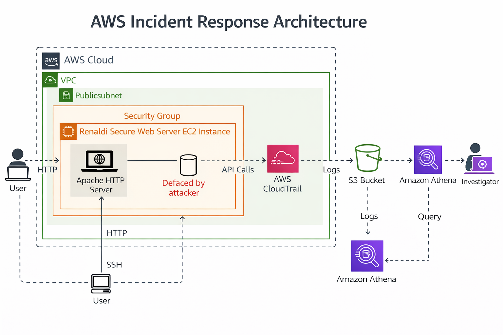

# 🔍 AWS CloudTrail Forensic Investigation Lab

## 🎯 Scenario
A production web application was compromised through unauthorized security group modifications. This lab documents the complete incident response lifecycle using AWS native security tools.

## ⏱️ Incident Timeline
| Time | Event | Evidence |
|------|-------|----------|
| T-0 | Normal operation | Website functional, no alerts |
| T+5m | CloudTrail trail created | Baseline established |
| T+15m | Attack detected | Unauthorized `AuthorizeSecurityGroupIngress` API call |
| T+30m | Forensic investigation | Log analysis with Athena & AWS CLI |
| T+45m | Attacker identified | IAM user `malicious-actor` identified |
| T+60m | Remediation completed | Access revoked, security hardened |

## 🛠️ Forensic Tools & Techniques
### **Log Collection & Analysis**
- **AWS CloudTrail** - Comprehensive API activity logging
- **Amazon Athena** - SQL-based log querying for pattern detection
- **AWS CLI** - Command-line forensic investigation
- **Linux grep/awk** - Local log processing and pattern matching

### **Investigation Methodology**
1. **Evidence Collection** - Gather all relevant logs and artifacts
2. **Timeline Analysis** - Reconstruct attack sequence
3. **Attribution** - Identify source and methods
4. **Impact Assessment** - Determine scope of compromise
5. **Remediation** - Contain and eradicate threat

## 🔎 Investigation Findings
### **Attack Vector**
- **Method:** Unauthorized security group modification
- **API Call:** `AuthorizeSecurityGroupIngress` from unrecognized IP
- **Target:** Web server security group (port 22 opened to 0.0.0.0/0)
- **Timing:** 15 minutes after CloudTrail activation

### **Forensic Evidence**

1. **CloudTrail Log Entry:**
```json
{
  "eventTime": "2024-12-23T10:15:00Z",
  "eventSource": "ec2.amazonaws.com",
  "eventName": "AuthorizeSecurityGroupIngress",
  "userIdentity": {
    "arn": "arn:aws:iam::ACCOUNT_ID:user/malicious-actor"
  },
  "sourceIPAddress": "203.0.113.25",
  "requestParameters": {
    "groupId": "sg-0abcd1234",
    "ipPermissions": {
      "items": [{
        "ipProtocol": "tcp",
        "fromPort": 22,
        "toPort": 22,
        "ipRanges": {"items": [{"cidrIp": "0.0.0.0/0"}]}
      }]
    }
  }
}
```
2. **Athena Query for Investigation:**

```sql
-- Find all security group modifications in attack window
SELECT eventTime, userIdentity.arn, eventName, requestParameters
FROM cloudtrail_logs
WHERE eventName LIKE '%SecurityGroup%'
AND eventTime BETWEEN '2024-12-23T10:00:00Z' AND '2024-12-23T11:00:00Z'
ORDER BY eventTime DESC;
```

3. **CLI Investigation Command:**

```bash
# Extract suspicious events from CloudTrail logs
aws cloudtrail lookup-events \
  --lookup-attributes AttributeKey=EventName,AttributeValue=AuthorizeSecurityGroupIngress \
  --start-time 2024-12-23T10:00:00Z \
  --end-time 2024-12-23T11:00:00Z \
  --output json > forensic-evidence.json
```


# 🔍 AWS CloudTrail Forensic Investigation Lab

## 🎯 Executive Summary
A comprehensive security incident investigation involving unauthorized infrastructure modification, forensic log analysis, and multi-layer remediation.

## 🏗️ Investigation Architecture



## ⚡ Key Evidence

### 1. Attack Vector Identification

*IAM user `chaos` executing `AuthorizeSecurityGroupIngress` to open port 22 globally*

### 2. Infrastructure Compromise

*Normal configuration before compromise*


*Unauthorized rule allowing 0.0.0.0/0 access to SSH port*

### 3. Forensic Analysis

*Log analysis identifying attacker's activities across services*

### 4. OS-Level Intrusion & Remediation

*SSH access by `chaos-user` (top) → Session termination & account removal (bottom)*

### 5. Cloud-Level Remediation


*IAM permissions for `chaos` user revoked at cloud level*


## 📋 Investigation Timeline
| Phase | Action | Evidence |
|-------|--------|----------|
| **Detection** | Unauthorized SG modification detected | CloudTrail logs, SG rule changes |
| **Analysis** | Athena queries & log correlation | Query results, attack pattern |
| **Attribution** | IAM user `chaos` identified | User activity timeline |
| **Containment** | IAM access revoked, SG restored | IAM console, EC2 console |
| **Eradication** | OS user account removed | Terminal session, auth logs |

## 🛠️ Tools & Techniques
- **AWS CloudTrail** - API activity monitoring
- **Amazon Athena** - Log analysis at scale
- **AWS CLI** - Forensic data collection
- **Linux Authentication Logs** - OS-level intrusion detection
- **IAM & EC2 Console** - Access control & configuration management

## 📁 Complete Evidence Package
Full investigation artifacts available in the [screenshots/](screenshots/) directory:
- 10+ evidence files
- Raw log samples
- Configuration backups
- Investigation notes

## 🎓 Skills Demonstrated
- Cloud Security Incident Response
- Multi-layer Forensic Analysis (Cloud + OS)
- AWS Native Security Tool Proficiency
- Infrastructure Hardening & Remediation
- Comprehensive Documentation

---

## 👨‍💻 Investigator
**Renaldi** | Cloud Security Analyst  
[GitHub Profile](https://github.com/renaldi136)

*Documentation of hands-on incident response exercise.*


